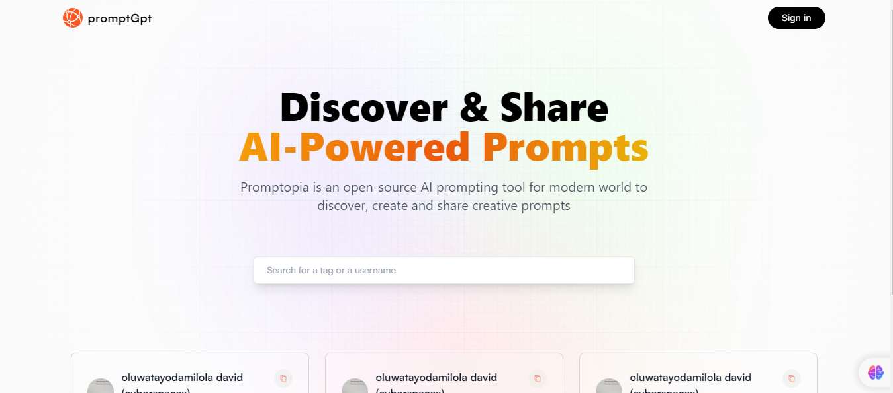

Prompt GPT


 Overview

Prompt GPT is a web application designed to create, store, edit, delete, and share prompts. It provides an intuitive interface for users to manage their prompts efficiently and share them with others.

Features

- Create Prompts**: Easily create new prompts with a simple form.
- Store Prompts**: Store prompts in a well-organized format for easy access.
- Edit Prompts**: Modify existing prompts to keep them up to date.
- Delete Prompts**: Remove prompts that are no longer needed.
- See other peoples prompt**: Share and see other people's prompt.

 Technologies Used

- **Frontend: React, Next.js, Tailwind CSS
- **Backend: Node.js, Express
- **Database: MongoDB (or your preferred database)
- **Authentication**: NextAuth.js (or your preferred authentication method)

 Installation

To get started with Prompt GPT, follow these steps:

1. Clone the Repository:
   ```bash
   git clone [https://github.com/yourusername/PromptGPT.git](https://github.com/oluwatayo-david/PromptGpt.git)
   cd PromptGPT
